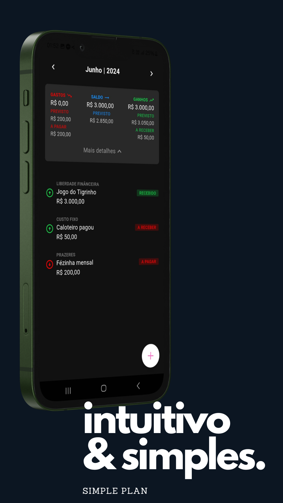

# Simple Plan

Bem-vindo ao Simple Plan, uma solução abrangente para monitorar e gerenciar suas finanças pessoais. Desenvolvido em Flutter, este aplicativo possui várias funcionalidades para ajudar você a controlar suas despesas e receitas mensais de forma eficiente.

## Funcionalidades

- **Adicionar Transações**: Adicione novas transações para meses anteriores ou futuros.
- **Pagamentos Parcelados**: Gerencie pagamentos parcelados com facilidade.
- **Transações Fixas**: Configure transações fixas mensais que se repetem automaticamente.
- **Gerenciamento de Ocorrências**: Marque transações como concluídas com a propriedade `done`.
- **Reverter Transações**: Possibilidade de reverter transações se necessário.
- **Visões Mensais**: Visualize suas finanças por mês.
- **Categorias Personalizadas**: Categorize suas transações para um melhor acompanhamento.

## Estrutura do Banco de Dados

O aplicativo utiliza o Isar para persistência de dados local, com os seguintes modelos principais:

- **DoneTransactionModel**: Representa transações concluídas.
- **TransactionEntryModel**: Representa as entradas de transações com detalhes como descrição, valor, data de vencimento, categorias, tipo de recorrência, entre outros.

## Tecnologias Utilizadas

- **Flutter**: Framework principal para desenvolvimento do aplicativo. 
- **Isar Database**: Banco de dados multiplataforma super rápido para Flutter.

## Instalação

Para clonar e rodar este aplicativo, siga os passos abaixo:

1. Clone o repositório:
    ```sh
    git clone https://github.com/youngNyvek/simple-plan.git
    cd simple-plan.git
    ```

2. Instale as dependências:
    ```sh
    flutter pub get
    ```

3. Configure o banco de dados e as variáveis de ambiente necessárias.

4. Execute o aplicativo:
    ```sh
    flutter run
    ```

## Capturas de Tela

Adicione capturas de tela do aplicativo para demonstrar suas funcionalidades:




## Contribuição

Se você deseja contribuir com este projeto, siga os passos abaixo:

1. Faça um fork do repositório.
2. Crie uma branch para sua feature ou correção de bug:
    ```sh
    git checkout -b feature/nova-feature
    ```
3. Commit suas alterações:
    ```sh
    git commit -m 'Adiciona nova feature'
    ```
4. Envie para a branch:
    ```sh
    git push origin feature/nova-feature
    ```
5. Abra um Pull Request.

## Licença

Este projeto está licenciado sob a licença APACHE LICENSE, VERSION 2.0. Veja o arquivo [LICENSE](LICENSE) para mais detalhes.

## Contato

Se você tiver alguma dúvida ou sugestão, sinta-se à vontade para entrar em contato:
- LinkedIn: [Kevin Faria](https://www.linkedin.com/in/kevin-faria221/)

---

Feito com ❤️ por [Kevin Faria](https://github.com/youngNyvek)
